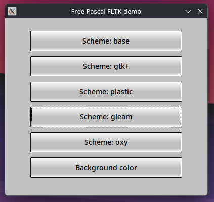

# PasFLTK
Free Pascal bindings for FLTK / CFLTK GUI. But should also work in Embarcadero Delphi.

FLTK is a lightweight, cross‑platform C++ GUI toolkit designed for speed, small binaries, and minimal dependencies. It provides modern GUI functionality without relying on Qt or GTK or Windows controls, making it ideal for portable, statically linked applications.

<ins>**Key Advantages**</ins>
- Lightweight architecture — FLTK is intentionally small, fast to compile, and produces compact executables. 
- Cross‑platform — Supports Linux/UNIX (X11 & Wayland), Windows, and macOS with consistent APIs. 
- No Qt or GTK or Windows controls required — FLTK provides its own widget set and rendering system, avoiding heavy external GUI frameworks. 
- Static linking support (or optionally shared linking) — Designed to be modular and small enough for fully static builds. 
- OpenGL support — Built‑in OpenGL and GLUT‑style API for 2D/3D graphics. 
- FLUID UI designer — Includes a visual interface builder for rapid GUI creation. 
- Simple, clean API — Focuses on straightforward event handling and minimal abstraction layers. 
- Permissive licensing — LGPL with exceptions allowing static linking in commercial apps. 

<ins>**Additional Features**</ins>
- Consistent native‑style widgets across platforms.
- Fast startup time — ideal for utilities and embedded tools.
- Small dependency chain — avoids large frameworks and runtime engines.
- Active open‑source development with clear documentation.

<ins>**About Pango and Cairo in FLTK**</ins>

Even though FLTK does not require GTK, it can optionally use Cairo and Pango when compiled with those features enabled:
1. Cairo integration — FLTK can use Cairo as an alternative 2D drawing backend for high‑quality vector rendering.
   - Enables anti‑aliased shapes, scalable graphics, and better text rendering.
   - Some Linux distributions compile FLTK with Cairo enabled by default.
2. Pango support — optional text layout engine for advanced international text shaping.
   - Useful for complex scripts (Arabic, Indic, etc.).
   - Not required for basic Latin text.

[FLTK repository](https://github.com/fltk/fltk)

[CFLTK repository](https://github.com/MoAlyousef/cfltk)

## Screenshot of "scheme" example (examples/scheme/scheme.lpr)

<p align="center">
  
</p>

## Versioning
Version number is synchronized with CFLTK version. So "1.5.23.4" mean that binding was made on CFLTK version 1.5.23. The last part "4" is actualy PasFLTK version which will be increased in case of bug fixes / missing features

Version: 1.5.23.4

For CFLTK version: 1.5.23

For FLTK version: 1.4.5

## History
- 1.5.23.4: Finally fixed static linking issues and make it as default instead of shared libs
- 1.5.23.3: Experimental static linking
- 1.5.23.2: New demos
- 1.5.23.1: First version

## Tested platforms
- Linux CachyOS (arch)
- I need help to someone test it also on macos and windows

## Building CFLTK and FLTK libs (linux)
You need to get FLTK and CFLTK sources first and build them. Depending on whether you want to make your app as statically linking libs (libcfltk.a, libfltk.a, etc) whis is default or use shared library (PasFLT `-dUSE_FLTK_SHARED_LIBS` option), you need to build CFLTK and FLTK with `-DFLTK_BUILD_SHARED_LIBS` and `-DCFLTK_BUILD_SHARED` set to `ON` or `OFF`:
- Static linking (default from version 1.5.23.4): Your executable will contain all necessary C / C++ code. You don't need to deploy any libraries related to CFLTK / FLTK, only OS / platform. This will produce larger executable file but in summary it is smaller than prividing shared libs because linker use only necessary objects from *.a libs
- Shared linking. Your executable will be smaller but you need to deploy CFLT / FLTK libraries with your app (libcfltk.so, lifltk.so / cfltk.dll, fltk.dll). See "Deploying your app" section for more info.

Prepare CFLTK and FLTK:
1. Extract CFLTK to some directory, for example "cfltk". 
2. Then extract FLTK and move everything to the "cfltk/fltk" directory
3. In "cfltk" root directory, call `cmake` command. Depending if you want static linking or shared libs, you must use `-DFLTK_BUILD_SHARED_LIBS` and `-DCFLTK_BUILD_SHARED` switch.  For example (if you need pango or cairo, swith it on) for static linking:
```
cmake -B bin -S . \
                -DCMAKE_BUILD_TYPE=Release \
                -DFLTK_USE_SYSTEM_LIBPNG=OFF \
                -DFLTK_USE_SYSTEM_LIBJPEG=OFF \
                -DFLTK_USE_SYSTEM_ZLIB=OFF \
                -DFLTK_BUILD_SHARED_LIBS=OFF \
                -DCFLTK_BUILD_SHARED=OFF \
                -DBUILD_SHARED_LIBS=OFF \
                -DFLTK_BUILD_GL=OFF \
                -DFLTK_BUILD_EXAMPLES=ON \
                -DFLTK_BUILD_TEST=ON \
                -DFLTK_OPTION_LARGE_FILE=ON \
                -DFLTK_BUILD_HTML_DOCS=OFF \
                -DFLTK_BUILD_PDF_DOCS=OFF \
                -DFLTK_USE_PANGO=OFF
```
4. Then build libraries:
```
cmake --build bin --parallel
```
5. This will produce series of *.a libs or in case of shared libs - one single libcfltk.so / cfltk.dll library containing CFLTK and also FLTK source. In shared libs mode you don't need separated libfltk.so, libfltk_images.so, libfltk_forms.so etc. Everything your app need will be in one libcfltk.so / cfltk.dll. You can find libcfltk.a / libcflt.so/dll in "cfltk/bin" directory and FLTK *.a libs in "cfltk/bin/fltk/lib" directory.

## Building project using PasFLTK
### Using Lazarus
Open some example or create new project and use this very simple hello demo:
```pascal
program hello;

{$mode objfpc}{$H+}

uses
  {$IFDEF UNIX}
  cthreads,
  {$ENDIF}
  Classes,

  cfl,
  cfl_button,
  cfl_widget,
  cfl_image,
  cfl_window;

// the button's callback
procedure cb(w: PFl_Widget; data: Pointer); cdecl;
begin
  Fl_Widget_set_label(w, 'Works!');
end;

function main: Integer;
var
  w: PFl_Window;
  b: PFl_Button;
begin
  Fl_init_all();        // init all styles
  Fl_register_images(); // necessary for image support
  Fl_lock();            // necessary for multithreaded support
  w := Fl_Window_new(100, 100, 400, 300, nil);
  b := Fl_Button_new(160, 210, 80, 40, 'Click me');
  Fl_Window_end(w);
  Fl_Window_show(w);
  Fl_Button_set_callback(b, @cb, nil);
  Result := Fl_run();
end;

begin
  main;
end.  
```

In lazarus `Project->Project options`. Go to `Compiler options -> Paths` and add path to PasFLTK source (-Fu) and your *.a / libcfltk.so / cfltk.dll libraries (-Fl). If you are using shared libs, then you need to set `-dUSE_FLTK_SHARED_LIBS` in your `Project->Project options -> Compiler options -> Other options` or in commandline.
On linux, in case of static linking, you need to also add path (-Fl) to `libgcc` which in most cases is in `/usr/lib/gcc/x86_64-pc-linux-gnu/16.1.1/`. Otherwise you may get linking errors about missing `crtbeginS.o` and `crtendS.o`. If you are using commandline to compile your project then you can set it by adding `-Fl/usr/lib/gcc/x86_64-pc-linux-gnu/16.1.1`.

Now you can build your project.
### Using command line
Go to your project or demo dir and run this command. It expect that *.a / libcfltk.so / cfltk.dll libs are in local "libs" dir and PasFLTK source in local "PasFLTK" dir. Change that for your need. Also remember about `-dUSE_FLTK_SHARED_LIBS` in case of shared linking.
```
/usr/bin/fpc
-MObjFPC
-Scghi
-CX
-Cg
-O3
-Xs
-XX
-l
-vewnhibq
-Filib/x86_64-linux
-Fl/usr/lib/gcc/x86_64-pc-linux-gnu/16.1.1
-Fl./libs
-Fu/PasFLTK/examples/hello/
-Fu./PasFLTK
-FUlib/x86_64-linux
-FE.
-ohello
hello.lpr

```

## Deploying your app
- On windows, if you are using shared libs, simply copy cfltk.dll into executable directory and that is it. In case of static linking, you don't need to do anything.
- On linux, if you are using shared libs and you want your app use libcfltk.so from directory where executable is, then you have two options:
Create `run.sh` script which point to your local dir:
```
#!/bin/bash
set -e
DIR="$(cd "$(dirname "${BASH_SOURCE[0]}")" && pwd)"
export LD_LIBRARY_PATH="$DIR/libs:${LD_LIBRARY_PATH:-}"
exec "$DIR/hello" "$@"
```
Make it executable and run script.

Second option is special `-rpath` linker option. You can set it in Lazarus `Project -> Project options -> Compiler options -> Compile and linking` by setting -k option. Or in command line:
```
/usr/bin/fpc
....
-k-rpath=$ORIGIN/libs
....
hello.lpr
```
Now your app will run without `LD_LIBRARY_PATH` and use libcfltk.so from "libs" dir where your executable is. Make sure to copy it there.

In case of static linking on linux, you don't need to provide this lib. But you may need some OS missing libs (especially when using cairo or pango). You can check this by running `ldd <your_app_executable>`

## Other compiling options
If you want to use cairo or pango in FLTK, then in your project you need to set `-dUSE_FLTK_PANGO` / `-dUSE_FLTK_CAIRO`. This functionality is not tested yet.

## ~~Building project using PasFLTK and static libs (experimental with not solved bugs)~~
<span style="color:red">Fixed in version 1.5.23.4</span>

<del>
Free Pascal can link C static *.a libs. I was able to make app which doesn't use libcfltk.so and libfltk.so at all. Just one single and small executable which contain C/C++ binary code. But it has bug which I'm not able to solve. I think it is "Static Initialization Order Fiasco" issue but then why exactly the same demo written in C works fine? 

To enable static linking:
1. Build CFLTK and FLTK with `-DFLTK_BUILD_SHARED_LIBS=OFF` and `-DCFLTK_BUILD_SHARED=OFF` which produce *.a libs only. Then in simple demo I linked these libs and all dependencies (order has matter!):
2. Make sure that `Project -> Project options -> Compiler options -> Paths` point to directory which contain *.a libs instead of *.so / *.dll.
3. Switch PasFLTK to static linking by setting `-dUSE_FLTK_STATIC` in `Project -> Project options -> Compiler options -> Other options` or in command line:
```
/usr/bin/fpc
....
-dUSE_FLTK_STATIC
....
static_error_to_solve.lpr
```
4. You can use a demo which shows problematic SIGSEGV error. You can find it in `/test/static_error_to_solve.lpr`
5. Demo is running but has bugs, for example `Fl_file_chooser_show` is crashing with SIGSEGV. Problem is in `Fl_File_Chooser2.cxx` in const:
```C
const char      *Fl_File_Chooser::filesystems_label = Fl::system_driver()->filesystems_label();   
```
Seems like `Fl_File_Chooser` is initialized before `Fl_System_Driver` class which result with const beeing empty (null). Is it "Static Initialization Order Fiasco"? But then why the same demo written in C works? `ldd` command shows that C and FPC demo link to the same libs and even in the same order. I guess that this is not possible or even is not a good practice. Shared libraries are better solutions but you need to deploy extra ~4MB lib, static linking would produce extremely small executable without dependencies but don't know if it is possible to solve this issue, `--whole-archive` switch didn't fix it either.

If someone could help me with this I would be grateful
</del>
